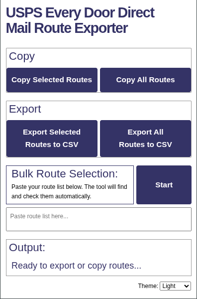

  

# USPS EDDM® Route Exporter

Export USPS Every Door Direct Mail (EDDM®) route data directly from `eddm.usps.com` into CSV files or your clipboard.

  

---

## Who this is for

This extension is built for people who actively run USPS EDDM® campaigns and need route data quickly and repeatedly.

It’s a good fit if you are:
- A local marketer managing EDDM campaigns for clients
- A print shop or mail house preparing route lists
- A local business owner running your own mailers
- Comparing routes across multiple ZIP codes

Most users need to collect route data from many ZIP codes to build intuition around household counts and estimated costs. This tool removes the manual steps so you can focus on the decision making.

---

## What this does

This extension removes repetitive work from the USPS EDDM website.

You can:
- **Export to CSV:** Download route data for spreadsheets.
- **Copy to Clipboard:** Paste data directly into emails or docs.
- **Flexible Selection:** Work with all routes on the map or just specific ones you've clicked.
- **Bulk Checkbox Selection:** Quickly check routes and save time.

---

## Quick preview

The popup appears directly on the EDDM site. It is designed to be simple, fast, and stays out of your way until you need it.

---

## How to use

1. Visit [eddm.usps.com](https://eddm.usps.com).
2. Search for routes by ZIP code.
   > **Tip:** You can search multiple ZIP codes by separating them with commas:
   > `12345, 12346, 12347`
3. Use the standard USPS filters as needed:
   - **Map → Residential:** Toggle between "Residential & Business" or "Residential Only".
   - **Map → Route:** Filter by City, Rural/Highway, or PO Box.
4. Click the extension icon to copy or export your data.

---

## Features

### Export and copy options
- Copy Selected Routes
- Copy All Routes
- Export Selected Routes (CSV)
- Export All Routes (CSV)

### Bulk Route ID auto-selection
Paste a list of USPS route IDs into the extension to automatically select them on the map.

This is useful when:
- Rebuilding previous campaigns
- Re-checking known routes
- Avoiding repetitive clicking on large route lists

### Faster route comparison
By exporting route data quickly, you can compare household counts and estimate campaign costs without clicking through individual table rows.

### Theme preferences
The extension matches your system theme by default. If you change it, your preference saves to your Chrome profile and follows you to other computers. If you aren't signed in, it saves locally to your current browser.

---

## Open source

This project is open source. Contributions, bug reports, and feature requests are welcome.
