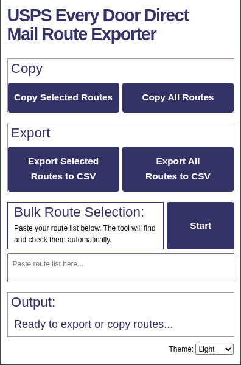

  

# Route Exporter for USPS EDDM®

**The fastest way to extract, copy, and compare USPS EDDM® route data without the manual clicking.**

Stop manually copying household counts and clicking individual rows on the USPS map. This tool extracts complete route data directly from eddm.usps.com into ready-to-use CSV files or your clipboard in seconds.

  

---

## Who this is for

This extension is built for high-volume mailers who need to pull accurate route data quickly and repeatedly. It is a perfect fit if you are:

* **Local Marketers & Agencies** managing campaigns and building quotes for clients.
* **Print Shops & Mail Houses** preparing route lists and estimating postage costs.
* **Local Business Owners** running targeted local mail drops.
* **Media Buyers** comparing counts across dozens of ZIP codes simultaneously.

> **The Problem:** The official USPS tool is powerful for mapping but tedious for data collection. Building an intuition for household counts and campaign costs usually requires hundreds of manual clicks. This tool eliminates the friction so you can focus on strategy.

---

## Core Features

### One-Click Export & Copy

* **Export All or Selected Routes (CSV):** Download clean, formatted route data straight to a spreadsheet.
* **Copy to Clipboard:** Instantly paste data directly into your own spreadsheets, estimates, or client emails.
* **Flexible Mapping:** Pull data for an entire ZIP code instantly, or only the specific routes you’ve highlighted.

### Bulk Route ID Auto-Selection

Already know which routes you want? Paste a comma-separated list of your target USPS Route IDs directly into the extension, and it will **automatically check and highlight them on the map** for you.

* *Perfect for:* Rebuilding last year's campaigns, verifying known routes, or bypassing the map entirely on massive lists.

### Premium Dark & Light Themes

Built to look seamless no matter how you work. The extension automatically detects your system preferences for a native feel, but allows you to lock in Dark Mode or Light Mode manually. Your visual preference automatically saves to your active profile, instantly syncing across all of your workstations.

---

## Visual Preview

The popup overlay loads directly on top of the official EDDM site. It is designed to be ultra-lightweight, fast, and stays entirely out of your way until the moment you need to move data.

---

## How to use

1. Go to [eddm.usps.com](https://eddm.usps.com).
2. Search for your target routes by ZIP code.
    * *Tip:* You can search multiple ZIP codes at once by separating them with commas (e.g., `12345, 12346, 12347`).
3. Apply your standard USPS filters (e.g., *Residential Only*, *City vs. Rural*).
4. Open the extension popup to instantly copy or export your data.

---

## For Developers & Contributors

This project is 100% open-source under the MIT License. Contributions, bug reports, and feature requests are highly welcome.

### Local Development

1. Clone this repository.
2. Open Chrome and navigate to `chrome://extensions/`.
3. Enable **Developer mode** (top-right toggle).
4. Click **Load unpacked** and select the project directory.
